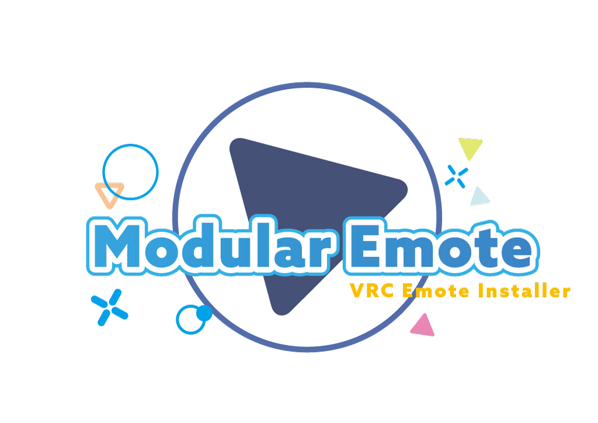

<figure markdown>
  { width="720" }
</figure>

# Modular Emote

**Modular Emote** is an **NDMF-based, non-destructive animation patch tool** for VRChat SDK3 Avatars,  
designed to make it easy to integrate animations into your avatar.

## Features

- **Does not modify the original AnimatorController assets**.  
  All graph changes are applied only at the **NDMF VirtualAnimatorController** level.
- Follows the **non-destructive** principle: it does not directly edit original menu/controller assets.
- Updates the **virtual controller during the NDMF build pipeline**, and applies only the final output.
