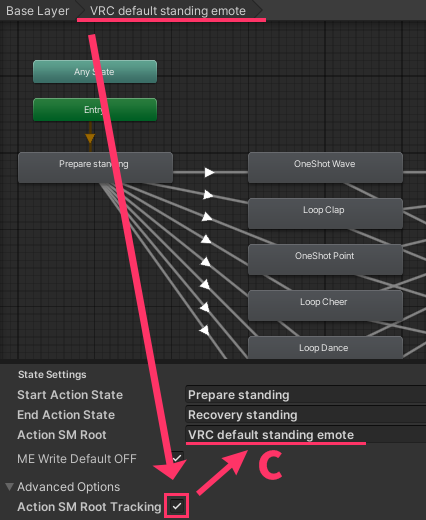

# VRC Emote Installer

このドキュメントは **VRC Emote Installer のインスペクターレイアウト**を基準に、  
各項目が何を意味するか（自動検出／検証を含む）を整理したリファレンスです。

> 前提
>
> - 本コンポーネントは基本的に **`VRCEmote`(Int) パラメータ基準の Emote 構造**を前提に動作します。
> - Unity Animator の基本概念（レイヤー／ステート／遷移／パラメータ）を理解している前提で書かれています。

---

## 基本動作フロー

`VRC Emote Installer` は、アバターの **Action / FX レイヤー**に ME テンプレート（AnimatorController）をマージし、ビルド時に Emote 動作を構成します。  

{ width="250" }

- オブジェクト（Installer）が **無効**になっている場合、その項目はビルド工程で **スキップ**されます。
- 同一スロットに Installer が複数存在する場合、**ヒエラルキー上位（ルートに近い）**の項目が優先されます。

---

## インスペクター構成（一覧）

インスペクターは次の順序で構成されます。

1. **コンテンツ**
2. **開発者オプション**
3. **Setup VRC Emote** / **デフォルト**
4. **適用内容を表示（プレビュー）**
5. **Editor Language**

---

## 1) コンテンツ

この領域は「現在の設定内容」を素早く確認するための場所です。

- **名前**  
  エモート名（`emoteName`）を表示します。 **(A)**  
  （この値は下の *開発者オプション → メニュー設定 → エモート名* と連動します。）

- **アイコンプレビュー**  
  メニューアイコン（`menuIcon`）をプレビュー表示します。 **(B)**

- **適用スロット番号 (1～8)**  
  適用するスロット（`slotIndex`）を指定します。 **(C)**  
  （この値はメニュー／Animator マージ時に `VRCEmote == slot` 条件として使用されます。）

{ width="500" }

---

## 2) 開発者オプション

この領域には自動検出／検証／詳細設定が含まれます。  
問題が検出されると、右側に **警告／エラーアイコン**で状態が表示されます。 **(A)**

  { width="500" }

### 2-1) VRC エモート設定

- **対象 VRC エモートメニュー**  
  カスタマイズする Emote メニューを設定します。  
  **自動検出**を使用します。

---

### 2-2) メニュー設定

メニューに実際に反映される項目です。

- **エモート名**  
  VRC Emote メニューに表示される名前です。

- **メニューアイコン**  
  VRC Emote メニューに表示されるアイコンです。  
  アイコンが Texture2D アセットではない、またはインポート設定が VRC 検証に不利な場合、  
  **エラーボックス**とともに  
  **アイコン設定を修正 (256, Compressed)** ボタンが表示されることがあります。

- **タイプ**  
  コントロールタイプです。`None` は既存のタイプを保持します。

- **値**（読み取り専用）  
  スロット番号に対応する値です。

- **パラメータ**（読み取り専用）  
  `VRCEmote, Int` と表示されます。

---

### 2-3) アバターレイヤー設定

対象アバターのレイヤーコントローラを指定します。 

- **アバター Action レイヤー**  
  アバターディスクリプタの Action レイヤー設定を **自動検出**して使用します。

- **アバター FX レイヤー**  
  アバターディスクリプタの FX レイヤー設定を **自動検出**して使用します。

---

### 2-4) ME レイヤーマージ設定

- **ME Action レイヤー**  
  マージに使用する Action テンプレート（AnimatorController）を指定します。  
  テンプレート（ステート／遷移／パラメータ等）はサブステートマシンへ変換され、アバター Action レイヤーの指定区間（開始～終了）の間に挿入／置換されます。  
  テンプレート内で `VRCEmote` パラメータを条件に使用している場合、その条件は **指定したスロット値**へ変換されます。  
  基本的にテンプレートの **0 番レイヤー**を使用します。

- **ME FX レイヤー**  
  詳細オプションの **ME FX マージを使用** を有効にすると、このフィールドが有効になります。  
  マージに使用する FX テンプレート（AnimatorController）を指定します。  
  制作者が用意した **ME FX テンプレート（ステート／遷移／パラメータ等）** を、アバター FX コントローラへ **新規レイヤーとしてマージ／追加**します。  
  テンプレート内で `VRCEmote` パラメータを条件に使用している場合、その条件は **指定したスロット値**へ変換されます。  
  基本的にテンプレートの **0 番レイヤー**を使用します。

  > 同じ ME FX レイヤーを複数オブジェクトが共有している場合、構成／名前によって結果が変わる可能性があるため警告が表示されます。

---

### 2-5) ステート設定

- **開始アクションステート**  
  アバター Action レイヤーで Emote 分岐が開始される基準ステート名です。 **(A)**    
  `Setup VRC Emote` で自動検出するか、手動で入力できます。  
  入力が空で Action レイヤーがデフォルト（または Null）の場合、既定で `Prepare Standing` を使用します。  
  無効な場合はエラーが表示されます。

- **終了アクションステート**  
  アバター Action レイヤーで Emote 分岐が終了される基準ステート名です。 **(B)**    
  `Setup VRC Emote` で自動検出するか、手動で入力できます。  
  入力が空で Action レイヤーがデフォルト（または Null）の場合、既定で `BlendOut Stand` を使用します。  
  無効な場合はエラーが表示されます。

    { width="500" }

- **Action SM ルート**  
  詳細オプションの **アクションマージ範囲の自動追跡** を有効にしたときに表示されます。 **(C)**  
  自動追跡がルート指定が必要と判断した場合、`Setup VRC Emote` 実行時にフィールドが自動的に有効化されることがあります。  
  一般的な Action 構造ではない、または開始／終了ステートがサブステートマシン内部にある場合は、ルートを手動で指定してください。  
 
    { width="500" }

---

### 2-6) ME Write Defaults OFF

- **ME Write Defaults OFF**  
  ME レイヤー内の Write Defaults をすべて OFF に揃えるオプションです。（既定: true）

---

## 3) 詳細オプション

詳細オプションは「自動追跡／マージ範囲／FX マージ拡張」を扱います。

- **アクションマージ範囲の自動追跡**  
  Action 構造が複雑な場合、スコープ（ルート）ベースの検出を支援します。（Action SM ルートと併用）  
  このオプションがオンのとき、追加フィールドが表示されます。（**Action SM ルート**）

- **ME FX マージを使用**  
  表情／オブジェクトアニメーション／FX／サウンドなど「動作以外の演出」も一緒に提供したい場合に ME FX レイヤーを使用します。  
  このオプションがオンのとき、追加フィールドが表示されます。（**ME FX レイヤー**）

- **+ 追加 ME FX**  
  FX テンプレートを拡張として追加します。（最大 2 個）  
  性能／最適化に関する案内が表示されます。

- **ME メニューアイコンに置き換え**  
  最上位 Emote メニューアイコンを ME アイコンへ自動適用します。（既定: true）

---

## 4) Setup VRC Emote / デフォルト

### Setup VRC Emote

ボタンを押すと、可能な範囲で設定を自動的に埋めるよう設計されています。

**動作項目**

1. アバターディスクリプターの探索
2. Action / FX レイヤーの自動設定（必要時）
3. Emote メニューの自動検出（必要時）
4. 開始／終了アクションステートの自動推定（可能な場合）
5. （条件により）アクションマージ範囲の自動追跡に必要な値を自動設定

問題がある場合、通常は **Setup VRC Emote を先に実行**するのが最も早いです。

  { width="500" }

### デフォルト

現在のコンポーネント値をデフォルトへ初期化し、Undo を記録します。

---

## 5) 適用内容を表示（プレビュー）

ビルド前に「メニューにどのような変更が入るか」を表で確認できます。

表の列:

- **No.**
- **名前（前）** / **名前（後）**
- **タイプ（前）** / **タイプ（後）**

現在のコンポーネントが実際に変更するスロットは、「後（After）」の値が強調表示されます。

  { width="500" }

---

## 6) Editor Language

インスペクター UI 言語を選択します。
