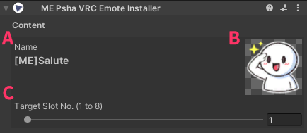

# VRC Emote Installer（制作者ガイド）

`VRC Emote Installer` は配布用 Emote プレハブに付けるコンポーネントで、  
ユーザーがプレハブをアバターへ入れるだけで Emote スロットを導入できるようにします。

---

## 1) 基本情報

### 1-1) エモート名 / アイコン / スロット / タイプ

- **エモート名**  
  メニューに表示される名前です。
- **メニューアイコン**  
  メニューに表示されるアイコンです。
- **Slot Index**  
  適用する Emote スロット番号（1～8）です。
- **タイプ**  
  メニューのコントロールタイプです。

{ width="500" }

---

## 2) 開発者オプション

この領域には自動検出／検証／詳細設定が含まれます。  
問題が検出されると、右側に **情報／警告／エラーアイコン**で状態が表示されます。 **(A)**

  { width="500" }

### 2-1) ビルド設定

- **ビルド時オブジェクト名**  
  アバタービルド時に適用するオブジェクト名を設定します。  
  空欄の場合は、ビルド時に現在の GameObject 名を使用します。  
  **ME FX マージを使用** する場合は、後からオブジェクト名を変更してもアニメーションパスが変わって結果に影響しないよう、この値を設定して固定しておくことを推奨します。  
  この項目が空欄のときに **Setup VRC Emote** を押すと、現在の GameObject 名が自動入力されます。  
  この項目は詳細オプションの **ME FX マージを使用** を有効にしたときにのみ表示されます。

---

### 2-2) VRC エモート設定

- **対象 VRC エモートメニュー**  
  カスタマイズする Emote メニューを設定します。  
  **自動検出**を使用します。

---

### 2-3) メニュー設定

メニューに実際に反映される項目です。

- **エモート名**  
  VRC Emote メニューに表示される名前です。

- **メニューアイコン**  
  VRC Emote メニューに表示されるアイコンです。  
  アイコンが Texture2D アセットではない、またはインポート設定が VRC 検証に不利な場合、  
  **エラーボックス**とともに  
  **アイコン設定を修正 (256, Compressed)** ボタンが表示されることがあります。

- **タイプ**  
  コントロールタイプです。`None` は既存のタイプを保持します。

- **値**（読み取り専用）  
  スロット番号に対応する値です。

- **パラメータ**（読み取り専用）  
  `VRCEmote, Int` と表示されます。

---

### 2-4) アバターレイヤー設定

対象アバターのレイヤーコントローラを指定します。

- **アバター Action レイヤー**  
  アバターディスクリプタの Action レイヤー設定を **自動検出**して使用します。

- **アバター FX レイヤー**  
  アバターディスクリプタの FX レイヤー設定を **自動検出**して使用します。

---

### 2-5) ME レイヤーマージ設定

- **ME Action レイヤー**  
  マージに使用する Action テンプレート（AnimatorController）を指定します。  
  テンプレート（ステート／遷移／パラメータ等）はサブステートマシンへ変換され、アバター Action レイヤーの指定区間（開始～終了）の間に挿入／置換されます。  
  テンプレート内で `VRCEmote` パラメータを条件に使用している場合、その条件は **指定したスロット値**へ変換されます。  
  基本的にテンプレートの **0 番レイヤー**を使用します。

- **ME FX レイヤー**  
  詳細オプションの **ME FX マージを使用** を有効にすると、このフィールドが有効になります。  
  マージに使用する FX テンプレート（AnimatorController）を指定します。  
  制作者が用意した **ME FX テンプレート（ステート／遷移／パラメータ等）** を、アバター FX コントローラへ **新規レイヤーとしてマージ／追加**します。  
  テンプレート内で `VRCEmote` パラメータを条件に使用している場合、その条件は **指定したスロット値**へ変換されます。  
  基本的にテンプレートの **0 番レイヤー**を使用します。

  > 同じ ME FX レイヤーを複数オブジェクトが共有している場合、構成／名前によって結果が変わる可能性があるため警告が表示されます。

---

### 2-6) ステート設定

- **開始アクションステート**  
  アバター Action レイヤーで Emote 分岐が開始される基準ステート名です。 **(A)**  
  `Setup VRC Emote` で自動検出するか、手動で入力できます。  
  入力が空で Action レイヤーがデフォルト（または Null）の場合、既定で `Prepare Standing` を使用します。  
  無効な場合はエラーが表示されます。

- **終了アクションステート**  
  アバター Action レイヤーで Emote 分岐が終了される基準ステート名です。 **(B)**  
  `Setup VRC Emote` で自動検出するか、手動で入力できます。  
  入力が空で Action レイヤーがデフォルト（または Null）の場合、既定で `BlendOut Stand` を使用します。  
  無効な場合はエラーが表示されます。

    { width="500" }

- **Action SM ルート**  
  詳細オプションの **アクションマージ範囲の自動追跡** を有効にしたときに表示されます。 **(C)**  
  自動追跡がスコープ指定が必要だと判断した場合、`Setup VRC Emote` 実行時にこのフィールドが自動的に有効化されることがあります。

---

### 2-7) 詳細オプション

- **アクションマージ範囲の自動追跡**  
  Action レイヤーの特定サブステートマシン範囲だけを追跡対象に制限します。

- **ME FX マージを使用**  
  FX テンプレートをアバター FX にマージします。

- **追加 ME FX を使用**  
  追加 FX レイヤー拡張用のオプションです。

---

## 3) Setup VRC Emote

**Setup VRC Emote** ボタンを押すと、次を自動的に試行します。

1. アバターの基本 Action / FX レイヤーを探索
2. ExpressionsMenu ツリーから Emote メニューを探索
3. 開始／終了 Action ステートを探索
4. 必要に応じて Action SM ルートを自動追跡
5. **ビルド時オブジェクト名** が空欄なら、現在の GameObject 名を自動入力

---

## 4) ビルド時の動作

- Expressions Menu は原本アセットを直接変更せず、クローンしてパッチします。
- Action / FX Animator は原本 AnimatorController を直接変更せず、Virtual graph 上でマージします。
- 同じスロットが複数ある場合は、ヒエラルキー上位の Installer が最終的に優先されます。
- 同じ GameObject に複数の Installer が付いていても、**ビルド時オブジェクト名** の適用はそのオブジェクトの最上位 Installer 1 つだけが担当します。

---

## 5) 適用変更内容の表示（プレビュー）

Preview では、ビルド前に実際に適用される内容を確認できます。

### ラジアルプレビュー

<small>※ 1.5.1 バージョンから適用される内容です。</small>

- 現在のスロットがどの位置に入るか確認できます。
- 現在のコンポーネントが適用するスロットは、選択状態として強調表示されます。
- アイコンがある項目と名前だけの項目が、実際のメニューに近い形で表示されます。

  { width="280" }

### リストプレビュー

- 従来どおり、番号 / 名前（変更前後） / タイプ（変更前後）を表形式で比較できます。
- 現在のコンポーネントが実際に変更するスロットは、「After」側が強調表示されます。

---
