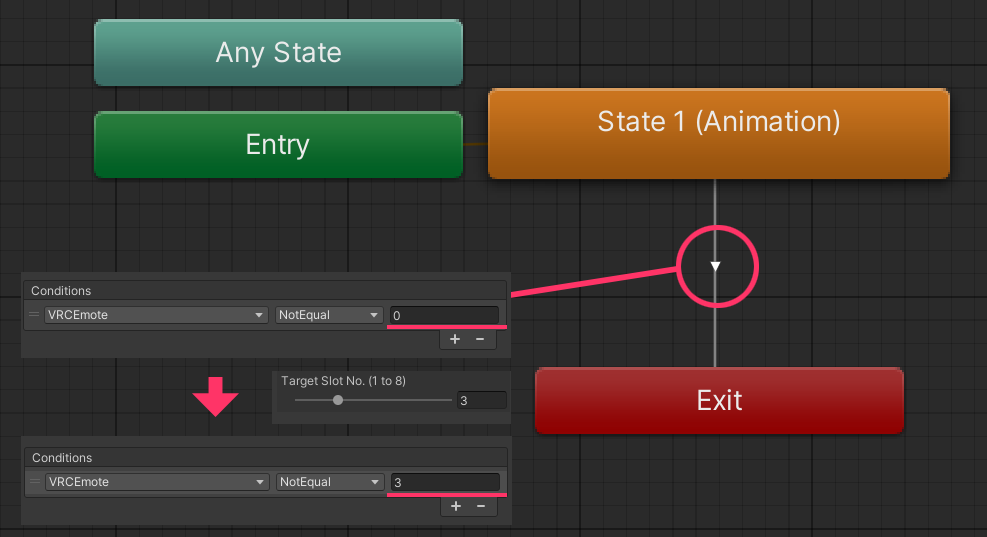

# ME FX Layer

`ME FX Layer` は、Modular Emote の **FX マージ工程**で使用される **Animator テンプレート（AnimatorController）**です。  
ビルド時にテンプレート内部の構成（ステート／遷移／パラメータ等）を基準として、アバターの **FX レイヤーへレイヤーを追加またはマージ**します。

---

## サンプルの場所

パッケージには基本テンプレートのサンプルが含まれています。

- `Packages/com.psha.modular.emote/Samples/ME Layer Templates`

---

## マージされる位置（概念）

ME FX テンプレートは、アバターの FX コントローラへ **追加レイヤーとして挿入**されます。  
動作原理は Modular Avatar の `MA Merge Animator` の流れに近く、`VRCEmote` インデックス置換ルールも併せて適用されます。

   { width="600" }  

> テンプレートは基本的に **0 番レイヤーのみ使用**します。

---

## テンプレートのパラメータ／条件の置換ルール

ME FX テンプレート内部で遷移（Transition）の条件として使用される **`VRCEmote` パラメータ**は、  
ビルド時に **Installer で指定したスロット値（1～8）** に合わせて自動的に置換されます。

   { width="500" }  

- 例：テンプレートに `VRCEmote == 1` 条件が含まれていても、  
  ユーザーがスロット 3 にインストールすると、ビルド結果では `VRCEmote == 3` に変換されます。
- この置換は、テンプレート内部の **すべての遷移条件**に適用されます。

---

## トラブルシューティング

### Q. Action レイヤーと FX レイヤーのエモートタイミングが一致しません。

Action と FX は別レイヤーで動作するため、アバター構造／遷移設定によってタイミングがずれる場合があります。  
特に Action 側の切り替えが遅れたり（例：レイヤーブレンド／中間ステート経由）、FX が即座に反応する場合に差が目立ちます。

**対処方法（推奨）**  
Action ↔ FX の「進入タイミング」を明確に揃えるために、**進入シグナル用パラメータ（例：Bool）** を追加する方法を推奨します。

1. Action / FX テンプレートに共通で使用するパラメータ（例：`ME_Enter`）を追加します。
2. Action テンプレートの「進入ステート」に `VRC Avatar Parameter Driver` を追加し、  
   進入時に `ME_Enter = On` を設定します。
3. FX テンプレート側では、関連ステート／遷移に `ME_Enter == True` 条件を追加し、  
   Action 進入と同時に FX が追従するよう構成します。

   { width="600" }  

> 핵심은「FX が `VRCEmote` 値だけで即反応」しないようにし、  
> Action の進入タイミングに合わせた **追加シグナル（ゲート）** を設けることです。

---

### Q. ME FX テンプレートを重複使用すると、FX アニメーションが正常に動作しません。

同じ ME FX テンプレートを複数箇所で重複使用すると、  
FX コントローラに **同一／類似レイヤーが繰り返し追加**され、意図しない結果になる場合があります。  
（例：Idle が重複して進入する、レイヤー同士が競合する など）

**推奨事項**  
可能な限り **同一 FX テンプレートの重複使用は避け**、FX 構成を統合するかテンプレートを分割して衝突を減らしてください。  
Installer はこの状況を検出すると、**重複使用を避けるよう警告**を表示します。

---

### Q. Gesture Manager でループアニメーションが不自然に見えます。

現在、一部環境では Gesture Manager のプレビューで **ループアニメーションが正しく表示されないケース**があります。  
プレビュー結果が想定と異なる場合は、**ビルド後にゲーム内で動作を直接テスト**することを推奨します。

---
