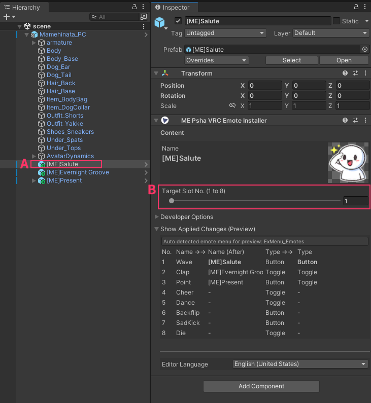

# VRC Emote Installer

`VRC Emote Installer` は、アニメーションを **「プレハブ単位でモジュール化」して配布**できるようにし、  
ユーザーが **複雑な Animator の編集なし**で、配布された ME プレハブをアバターに追加するだけで  
Emote（1～8 スロット）を簡単に導入できるようにするツールです。

---

## 要件（サポート対象）

このツールは、**VRCEmote（Emote Radial Menu）** を使用するアバターを前提に動作します。

次の条件を満たすアバターで正常に動作することが期待できます。

- **ラジアルメニュー（Emote メニュー）** から `VRCEmote` パラメータで動作するアバター
- **VRChat 標準の Action レイヤー**を使用している、または  
  `VRCEmote` パラメータを基準に Emote 分岐を構成した Action レイヤーを持つアバター

> 参考：「VRCEmote を使用している」とは通常、  
> ゲーム内ラジアルメニューで Emote を選択すると `VRCEmote` の値（1～8）が変化し、それで動作する構造を指します。

---

## 基本導入手順

1. アニメーションを適用する **アバターをシーンに配置**します。
2. 配布された **ME プレハブをシーンに配置**します。
3. ME プレハブを **アバターの子（下位）にドラッグして**入れます。 **(A)**
4. Installer で **適用スロット番号 (1～8)** を設定します。 **(B)**

    { width="500" }

5. **VRChat SDK メニューからアバターを Build** します。
6. ゲーム内で **ラジアルメニュー（デフォルト：R 長押し）** → **Emote メニュー**を開き、適用結果を確認します。 **(C)**

    { width="500" }

---

## 導入解説動画

<iframe width="580" height="580" src="https://www.youtube.com/embed/phu5HNi_exg" frameborder="0" allowfullscreen sandbox="allow-scripts allow-same-origin allow-popups allow-popups-to-escape-sandbox allow-presentation"></iframe>

---

## 非対応アバター / 適用時に問題が発生した場合

配布された ME プレハブを **サポート範囲外のアバターに適用**しようとしたり、  
導入手順の途中で問題が発生する場合があります。

その場合は、まず **開発者オプション（Developer Options）** を開き、  
表示される問題アイコン／状態を確認したうえで、以下の流れを推奨します。

### 推奨の解決方法: `Setup VRC Emote`

一般的に、開発者オプションにある **`Setup VRC Emote` ボタンを一度押すだけで**  
スクリプトが可能な範囲で問題を自動処理するよう設計されています。

- まず `Setup VRC Emote` を実行してみてください。
- 自動処理が難しい項目は、開発者オプション内で手動調整できます。

  { width="500" }

---

## 注意事項 / 制限事項

次のケースでは、正常な結果を保証できない場合があります。

- **非対応アバター**に適用する場合
- アバターの **体型（リターゲット／スケール差）** によりアニメーションが合わない場合
- **FX レイヤーマージを含むプレハブ**を非標準構造のアバターへ適用する場合
- `VRCEmote` を使用していても **Action レイヤー内部のサブステートマシン構造が非常に複雑**な場合  
  （追跡アルゴリズムが start/end の流れを安定して検出できず、マージに失敗する可能性があります）

また、現行バージョンは基本的に次の範囲を対象としています。

- **Stand 基準の Emote スロット 1～8** に対応（ラジアルメニューの 8 スロット）

---
