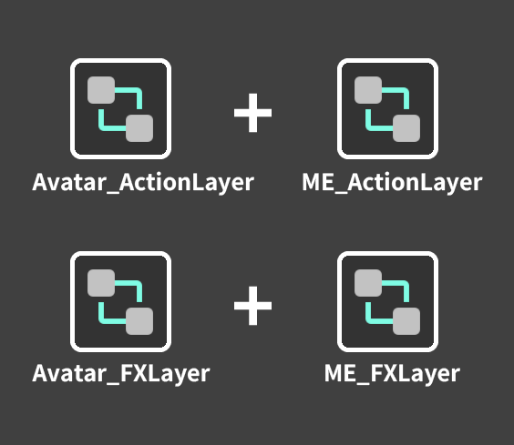
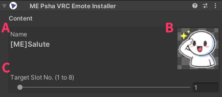
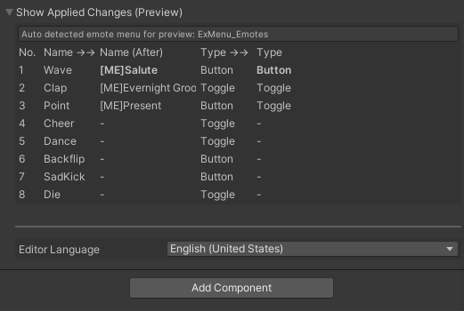

# VRC Emote Installer

이 문서는 **VRC Emote Installer 인스펙터 레이아웃**을 기준으로,
각 항목이 무엇을 의미하는지(자동 탐지/검증 포함) 정리한 레퍼런스입니다.

> 전제
>
> - 본 컴포넌트는 기본적으로 **`VRCEmote`(Int) 파라미터 기반 Emote 구조**를 전제로 동작합니다.
> - Unity Animator의 기본 개념(레이어/스테이트/전이/파라미터)을 알고 있다는 가정으로 작성되었습니다.

---

## 기본 동작 흐름

`VRC Emote Installer`는 아바타의 **Action/FX 레이어**에 ME 템플릿(AnimatorController)을 병합하여, 빌드 시점에 Emote 동작을 구성합니다.  

{ width="250" }

- 오브젝트(Installer)가 **비활성화**되어 있으면 해당 항목은 빌드 과정에서 **스킵**됩니다.
- 동일 슬롯에 Installer가 여러 개 존재하면, **하이어라키 상단(루트에 더 가까운) 항목이 우선**됩니다.

---

## 인스펙터 구성 한눈에 보기

인스펙터는 아래 순서로 구성됩니다.

1. **콘텐츠**
2. **개발자 옵션**
3. **Setup VRC Emote** / **기본값**
4. **적용 변경사항 표시 (프리뷰)**
5. **Editor Language**

---

## 1) 콘텐츠

이 영역은 “현재 설정이 무엇인지” 빠르게 확인하는 곳입니다.

- **이름**  
  이모트 이름(`emoteName`)을 표시합니다. **(A)**  
  (이 값은 아래 *개발자 옵션 → 메뉴 설정 → 이모트 이름*과 연결됩니다.)

- **아이콘 미리보기**  
  메뉴 아이콘(`menuIcon`)을 미리 보여줍니다. **(B)**

- **적용할 슬롯 번호 (1~8)**  
  적용할 슬롯(`slotIndex`)을 지정합니다. **(C)**  
  (이 값은 메뉴/Animator 병합 시 `VRCEmote == slot` 조건으로 사용됩니다.)

{ width="500" }

---

## 2) 개발자 옵션

이 영역은 자동 탐지/검증/세부 설정을 포함합니다.  
문제가 감지되면 우측에 **경고/오류 아이콘**으로 상태가 표시됩니다. **(A)**

  { width="500" }

### 2-1) VRC 이모트 설정

- **대상 VRC 이모트 메뉴**  
  커스터마이즈할 Emote 메뉴 필드를 설정합니다.
  **자동 탐지**를 사용합니다.

---

### 2-2) 메뉴 설정

메뉴에 실제로 반영되는 항목들입니다.

- **이모트 이름**  
  VRC Emote 메뉴에 표시될 이름입니다.

- **메뉴 아이콘**  
  VRC Emote 메뉴에 표시될 아이콘입니다.  
  아이콘이 Texture2D 에셋이 아니거나, 임포트 설정이 VRC 검증에 불리한 경우
  **오류 박스**와 함께 
  **아이콘 설정 수정 (256, Compressed)** 버튼이 표시될 수 있습니다.

- **타입**  
  컨트롤 타입입니다. `None`은 기존 타입을 유지합니다.

- **값** (읽기 전용)  
  슬롯 번호에 대응되는 값입니다.

- **파라미터** (읽기 전용)  
  `VRCEmote, Int`로 표시됩니다.

---

### 2-3) 아바타 레이어 설정

대상 아바타의 레이어 컨트롤러를 지정합니다. 

- **아바타 Action 레이어**  
  아바타 디스크립터 Action 레이어 설정을 **자동 탐지**하여 사용합니다.

- **아바타 FX 레이어**  
  아바타 디스크립터 FX 레이어 설정을 **자동 탐지**하여 사용합니다.

---

### 2-4) ME 레이어 병합 설정

- **ME Action 레이어**  
  병합에 사용할 Action 템플릿(AnimatorController)을 지정합니다.  
  템플릿(스테이트/전이/파라미터 등)은 서브 스테이트 머신으로 변환되어, 아바타 Action 레이어에서 지정된 구간(시작~종료) 사이에 삽입/치환됩니다.  
  템플릿 내부에서 `VRCEmote` 파라미터를 사용하는 조건은 **지정한 슬롯 값**으로 변환됩니다.  
  기본적으로 템플릿의 **0번 레이어**를 사용합니다.

- **ME FX 레이어**  
  고급 옵션의 **병합 ME FX 사용**을 활성화해야 해당 필드가 활성화됩니다.  
  병합에 사용할 FX 템플릿(AnimatorController)을 지정합니다.  
  제작자가 준비한 **ME FX 템플릿(스테이트/전이/파라미터 등)**을
  아바타 FX 컨트롤러에 **새 레이어 형태로 병합/추가**합니다.
  템플릿 내부에서 `VRCEmote` 파라미터를 사용하는 조건은 **지정한 슬롯 값**으로 변환됩니다.  
  기본적으로 템플릿의 **0번 레이어**를 사용합니다.

  > 동일한 ME FX 레이어를 여러 오브젝트가 공유하는 경우, 구성/이름에 따라 결과가 달라질 수 있어 경고가 표시됩니다.

---

### 2-5) 스테이트 설정

- **시작 액션 스테이트**  
  아바타 Action 레이어에서 Emote 분기가 시작되는 기준 스테이트 이름입니다. **(A)**    
  `Setup VRC Emote`로 자동 탐지하거나 수동 입력할 수 있습니다.  
  입력이 비어 있고 Action 레이어가 기본값(또는 Null)인 경우 기본적으로 `Prepare Standing`을 사용합니다.  
  유효하지 않으면 오류가 표시됩니다.

- **종료 액션 스테이트**  
  아바타 Action 레이어에서 Emote 분기가 종료되는 기준 스테이트 이름입니다. **(B)**    
  `Setup VRC Emote`로 자동 탐지하거나 수동 입력할 수 있습니다.  
  입력이 비어 있고 Action 레이어가 기본값(또는 Null)인 경우 기본적으로 `BlendOut Stand`를 사용합니다.  
  유효하지 않으면 오류가 표시됩니다.

    { width="500" }

- **액션 SM 루트**  
  고급 옵션의 **액션 루트 정밀추적**을 활성화할 때 노출됩니다. **(C)**  
  자동 추적이 루트 지정이 필요하다고 판단하면, `Setup VRC Emote` 실행 시 필드가 자동 활성화될 수 있습니다.  
  일반적인 Action 구조가 아니거나, 시작/종료 스테이트가 서브 스테이트 머신 내부에 있는 경우 직접 루트를 지정해 주세요.  
 
    { width="500" }

---

### 2-6) ME Write Default OFF

- **ME Write Default OFF**  
  ME 레이어에서 Write Defaults 관련 처리를 모두 OFF 방향으로 맞추는 옵션입니다. (기본값: true)

---

## 3) 고급 옵션

고급 옵션은 “자동 추적/병합 범위/FX 병합 확장”을 다룹니다.

- **액션 루트 정밀추적**  
  Action 구조가 복잡할 때 스코프(루트) 기반 탐지를 돕습니다. (Action SM Root와 함께 사용)
  이 옵션이 켜져 있을 때, 추가 필드가 노출됩니다.(**액션 SM 루트**)

- **병합 ME FX 사용**  
  표정/오브젝트 애니메이션/FX/사운드 등 “동작 외 연출”을 함께 제공하려는 경우 ME FX 레이어를 사용합니다.
  이 옵션이 켜져 있을 때, 추가 필드가 노출됩니다.(**ME FX 레이어**)

- **+ 추가 ME FX**  
  FX 템플릿을 확장으로 추가합니다. (최대 2개)  
  성능/최적화 관련 안내가 함께 표시됩니다.

- **ME 메뉴 아이콘 교체**  
  최상위 Emote 메뉴 아이콘을 ME 아이콘으로 자동 적용합니다. (기본값: true)

---

## 4) Setup VRC Emote / 기본값

### Setup VRC Emote

버튼을 누르면 가능한 범위에서 설정을 자동으로 채우도록 설계되어 있습니다.

**동작 항목**

1. 아바타 디스크립터 탐색
2. Action/FX 레이어 자동 설정(필요 시)
3. Emote 메뉴 자동 탐지(필요 시)
4. 시작/종료 액션 스테이트 자동 추정(가능한 경우)
5. (조건에 따라) 액션 루트 정밀추적에 필요한 값 자동 세팅

문제가 있을 때는 보통 **Setup VRC Emote를 먼저 실행하는 흐름**이 가장 빠릅니다.

  { width="500" }

### 기본값

현재 컴포넌트 값을 기본값으로 초기화하고, Undo를 기록합니다.

---

## 5) 적용 변경사항 표시 (프리뷰)

빌드 전에 “메뉴에 어떤 변경이 들어갈지” 표로 확인할 수 있습니다.

표 컬럼:

- **번호**
- **이름 (전)** / **이름 (후)**
- **타입 (전)** / **타입 (후)**

현재 컴포넌트가 실제로 변경하는 슬롯은 “후(After)” 값이 강조되어 표시됩니다.

  { width="500" }

---

## 6) Editor Language

인스펙터 UI 언어를 선택합니다.
