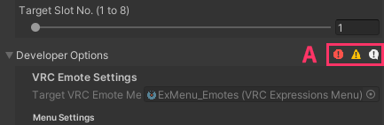
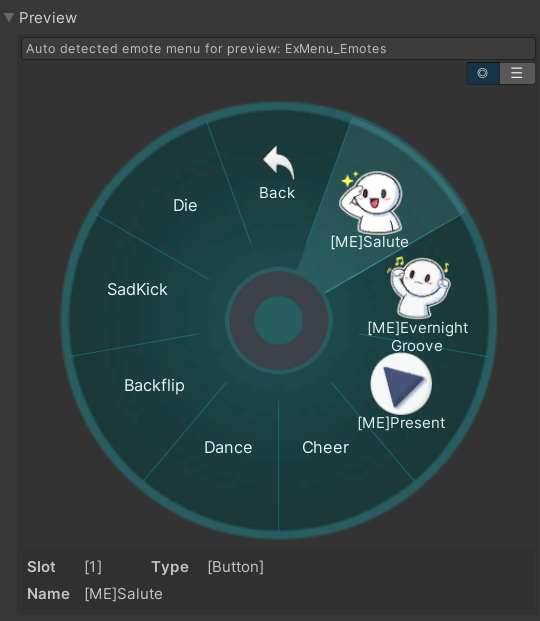

# VRC Emote Installer (제작자 가이드)

`VRC Emote Installer`는 배포용 Emote 프리팹에 붙여,  
사용자가 아바타에 프리팹을 넣는 것만으로 Emote 슬롯을 도입할 수 있게 하는 컴포넌트입니다.

---

## 1) 기본 정보

### 1-1) 이모트 이름 / 아이콘 / 슬롯 / 타입

- **이모트 이름**  
  메뉴에 표시될 이름입니다.
- **메뉴 아이콘**  
  메뉴에 표시될 아이콘입니다.
- **Slot Index**  
  적용할 Emote 슬롯 번호(1~8)입니다.
- **타입**  
  메뉴 컨트롤 타입입니다.

{ width="500" }

---

## 2) 개발자 옵션

이 영역은 자동 탐지/검증/세부 설정을 포함합니다.  
문제가 감지되면 우측에 **정보/경고/오류 아이콘**으로 상태가 표시됩니다. **(A)**

  { width="500" }

### 2-1) 빌드 설정

- **빌드 시 오브젝트 이름**  
  아바타 빌드 시 적용할 오브젝트 이름을 설정합니다.  
  공백으로 두면 빌드 시 현재 GameObject 이름을 사용합니다.  
  **병합 ME FX 사용** 시에는 이후 오브젝트 이름이 바뀌어도 애니메이션 경로가 달라져 결과에 영향을 주지 않도록, 이 값을 입력해 고정해 두는 것을 권장합니다.  
  이 항목이 비어 있을 때 **Setup VRC Emote**를 누르면 현재 GameObject 이름이 자동 입력됩니다.  
  이 항목은 고급 옵션의 **병합 ME FX 사용**을 활성화했을 때만 표시됩니다.

---

### 2-2) VRC 이모트 설정

- **대상 VRC 이모트 메뉴**  
  커스터마이즈할 Emote 메뉴 필드를 설정합니다.  
  **자동 탐지**를 사용합니다.

---

### 2-3) 메뉴 설정

메뉴에 실제로 반영되는 항목들입니다.

- **이모트 이름**  
  VRC Emote 메뉴에 표시될 이름입니다.

- **메뉴 아이콘**  
  VRC Emote 메뉴에 표시될 아이콘입니다.  
  아이콘이 Texture2D 에셋이 아니거나, 임포트 설정이 VRC 검증에 불리한 경우
  **오류 박스**와 함께 
  **아이콘 설정 수정 (256, Compressed)** 버튼이 표시될 수 있습니다.

- **타입**  
  컨트롤 타입입니다. `None`은 기존 타입을 유지합니다.

- **값** (읽기 전용)  
  슬롯 번호에 대응되는 값입니다.

- **파라미터** (읽기 전용)  
  `VRCEmote, Int`로 표시됩니다.

---

### 2-4) 아바타 레이어 설정

대상 아바타의 레이어 컨트롤러를 지정합니다. 

- **아바타 Action 레이어**  
  아바타 디스크립터 Action 레이어 설정을 **자동 탐지**하여 사용합니다.

- **아바타 FX 레이어**  
  아바타 디스크립터 FX 레이어 설정을 **자동 탐지**하여 사용합니다.

---

### 2-5) ME 레이어 병합 설정

- **ME Action 레이어**  
  병합에 사용할 Action 템플릿(AnimatorController)을 지정합니다.  
  템플릿(스테이트/전이/파라미터 등)은 서브 스테이트 머신으로 변환되어, 아바타 Action 레이어에서 지정된 구간(시작~종료) 사이에 삽입/치환됩니다.  
  템플릿 내부에서 `VRCEmote` 파라미터를 사용하는 조건은 **지정한 슬롯 값**으로 변환됩니다.  
  기본적으로 템플릿의 **0번 레이어**를 사용합니다.

- **ME FX 레이어**  
  고급 옵션의 **병합 ME FX 사용**을 활성화해야 해당 필드가 활성화됩니다.  
  병합에 사용할 FX 템플릿(AnimatorController)을 지정합니다.  
  제작자가 준비한 **ME FX 템플릿(스테이트/전이/파라미터 등)**을
  아바타 FX 컨트롤러에 **새 레이어 형태로 병합/추가**합니다.
  템플릿 내부에서 `VRCEmote` 파라미터를 사용하는 조건은 **지정한 슬롯 값**으로 변환됩니다.  
  기본적으로 템플릿의 **0번 레이어**를 사용합니다.

  > 동일한 ME FX 레이어를 여러 오브젝트가 공유하는 경우, 구성/이름에 따라 결과가 달라질 수 있어 경고가 표시됩니다.

---

### 2-6) 스테이트 설정

- **시작 액션 스테이트**  
  아바타 Action 레이어에서 Emote 분기가 시작되는 기준 스테이트 이름입니다. **(A)**    
  `Setup VRC Emote`로 자동 탐지하거나 수동 입력할 수 있습니다.  
  입력이 비어 있고 Action 레이어가 기본값(또는 Null)인 경우 기본적으로 `Prepare Standing`을 사용합니다.  
  유효하지 않으면 오류가 표시됩니다.

- **종료 액션 스테이트**  
  아바타 Action 레이어에서 Emote 분기가 종료되는 기준 스테이트 이름입니다. **(B)**    
  `Setup VRC Emote`로 자동 탐지하거나 수동 입력할 수 있습니다.  
  입력이 비어 있고 Action 레이어가 기본값(또는 Null)인 경우 기본적으로 `BlendOut Stand`를 사용합니다.  
  유효하지 않으면 오류가 표시됩니다.

    { width="500" }

- **액션 SM 루트**  
  고급 옵션의 **액션 루트 정밀추적**을 활성화할 때 노출됩니다. **(C)**  
  자동 추적이 루트 지정이 필요하다고 판단한 경우, `Setup VRC Emote` 실행 시 필드가 자동으로 활성화될 수 있습니다.

---

### 2-7) 고급 옵션

- **액션 루트 정밀추적**  
  Action 레이어의 특정 서브 스테이트 머신 범위만 추적 대상으로 제한할 때 사용합니다.

- **병합 ME FX 사용**  
  FX 템플릿을 아바타 FX에 병합합니다.

- **추가 ME FX 사용**  
  추가 FX 레이어 확장용 옵션입니다.

---

## 3) Setup VRC Emote

**Setup VRC Emote** 버튼을 누르면 다음을 자동으로 시도합니다.

1. 아바타의 기본 Action / FX 레이어 탐색
2. ExpressionsMenu 트리에서 Emote 메뉴 탐색
3. 시작/종료 액션 스테이트 탐색
4. 필요한 경우 액션 SM 루트 자동 추적
5. **빌드 시 오브젝트 이름**이 비어 있으면 현재 GameObject 이름 자동 입력

---

## 4) 빌드 시 동작

- Expressions Menu는 원본을 직접 수정하지 않고 클론하여 패치합니다.
- Action / FX Animator는 원본 AnimatorController를 직접 수정하지 않고 Virtual graph에서 병합합니다.
- 같은 슬롯이 여러 개 있을 때는 하이어라키 상단 Installer가 최종 우선권을 가집니다.
- 같은 GameObject에 Installer가 여러 개 붙어 있어도, **빌드 시 오브젝트 이름** 적용은 해당 오브젝트의 최상단 Installer 1개만 담당합니다.

---

## 5) 적용 변경사항 표시 (프리뷰)

Preview에서는 실제 적용될 내용을 빌드 전 확인할 수 있습니다.

### 레디얼 프리뷰

<small>※ 1.5.1 버전부터 적용되는 사항입니다.</small>

- 현재 슬롯이 어느 위치에 들어가는지 확인할 수 있습니다.
- 현재 컴포넌트가 적용하는 슬롯은 선택 상태로 강조되어 표시됩니다.
- 아이콘이 있는 항목과 이름만 있는 항목이 실제 메뉴에 가까운 형태로 표시됩니다.

  { width="280" }

### 리스트 프리뷰

- 기존처럼 번호 / 이름(전후) / 타입(전후)를 비교할 수 있습니다.
- 현재 컴포넌트가 실제로 변경하는 슬롯은 “후(After)” 값이 강조되어 표시됩니다.

---
