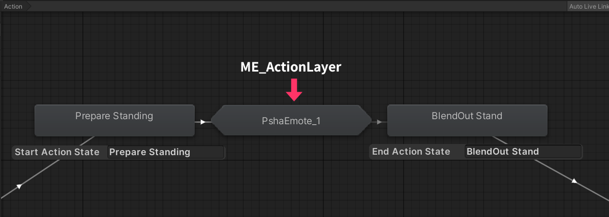

# ME Action Layer

`ME Action Layer`는 Modular Emote의 **Action 병합 알고리즘**에서 사용하기 위해 구성된 **Animator 템플릿(AnimatorController)** 입니다.  
이 템플릿은 빌드 시점에 템플릿 내부 구성(스테이트/전이/파라미터 등)을 **서브 스테이트 머신(Sub StateMachine)** 형태로 변환한 뒤, 아바타의 **Action 레이어**에 병합됩니다.

---

## 샘플 위치

패키지에는 기본 템플릿 샘플이 포함되어 있습니다.

- `Packages/com.psha.modular.emote/Samples/ME Layer Templates`

---

## 병합되는 위치(개념)

템플릿은 아바타 Action 레이어에서 **지정된 시작/종료 스테이트 사이**에 삽입됩니다.

즉, 흐름은 아래처럼 구성됩니다.

`Prepare Standing` → *(ME Template Sub StateMachine)* → `BlendOut Stand`   

   { width="600" }

> 시작/종료 스테이트는 Installer의 `시작 액션 스테이트 / 종료 액션 스테이트` 설정(또는 Setup 자동 추정)에 따라 달라질 수 있습니다.

## 템플릿 파라미터/조건 치환 규칙

ME Action 템플릿 내부에서 전이(Transition) 조건으로 사용되는 **`VRCEmote` 파라미터**는,
빌드 시점에 **Installer에서 지정한 슬롯 값(1~8)**에 맞게 자동으로 치환됩니다. 

   { width="500" }

- 예: 템플릿에 `VRCEmote == 1` 조건이 포함되어 있어도,
  사용자가 슬롯 3으로 설치하면 빌드 결과에서는 `VRCEmote == 3`으로 변환됩니다.
- 이 치환은 템플릿 내부의 **모든 전이 조건**에 적용됩니다.

> 따라서 템플릿은 특정 슬롯 번호에 고정해서 만들 필요가 없으며,  
> 하나의 템플릿을 여러 슬롯에서 재사용할 수 있습니다.

---

## 시작 스테이트 → 템플릿 서브머신 전이(Transition) 설정

“시작 스테이트에서 ME 템플릿 서브머신으로 들어가는 전이”의 성질(Exit Time, Duration, Interruption 등)을 템플릿에서 제어하고 싶다면,  
**`Modular Emote Transition Settings`** Behaviour를 사용하세요.

### 설정 방법

1. ME Action 템플릿에 독립된 스테이트를 하나 추가합니다.
2. 스테이트 이름을 다음처럼 지정해주세요.

   - `[ME] StartState Transition Settings`

3. 해당 스테이트에 Behaviour를 추가합니다.

   - `Add Behaviour` → `Modular Emote Transition Settings`

4. 원하는 전이 값을 설정합니다.
   - Exit Time / Duration / Offset / Interruption
   - Additional Conditions(추가 조건)  

   { width="800" } 

> 이 Behaviour가 존재하면 빌드 시점에 “시작 스테이트 → 템플릿 진입 전이”를 설정값 기준으로 재구성합니다.

---

## 문제 해결

### Q. Transition Settings를 설정했는데도 템플릿으로 빠르게 전환되지 않습니다.

아바타 Action 레이어에서 **Entry → ME 서브머신**으로 가는 경로 중간에,  
`VRC Playable Layer Control` Behaviour로 **Blend Duration**을 임의로 늘려둔 스테이트가 있으면 이런 현상이 발생할 수 있습니다.

**해결 방법(권장)**  
ME Action 템플릿에서 **Entry 직후 첫 스테이트(진입 직후 스테이트)**에 `VRC Playable Layer Control`을 추가하고,  
해당 Blend 설정이 의도한 전환 속도에 맞도록 조정해 주세요.

   { width="600" }    

---

### Q. Gesture Manager에서 루프 애니메이션이 이상하게 보입니다.

현재 일부 환경에서 Gesture Manager 미리보기는 **루프 애니메이션이 정상적으로 표시되지 않는 케이스**가 있습니다.  
미리보기 결과가 기대와 다르게 보인다면, **빌드 후 인게임에서 동작을 직접 테스트**하는 것을 권장합니다.

---

