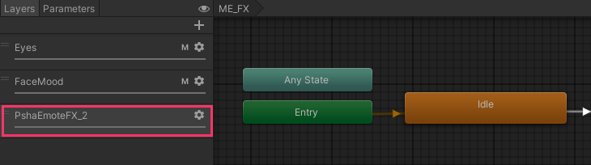

# ME FX Layer

`ME FX Layer`는 Modular Emote의 **FX 병합 과정**에서 사용되는 **Animator 템플릿(AnimatorController)** 입니다.  
빌드 시점에 템플릿 내부 구성(스테이트/전이/파라미터 등)을 기준으로 아바타의 **FX 레이어에 레이어를 추가하거나 병합**합니다.

---

## 샘플 위치

패키지에는 기본 템플릿 샘플이 포함되어 있습니다.

- `Packages/com.psha.modular.emote/Samples/ME Layer Templates`

---

## 병합되는 위치(개념)

ME FX 템플릿은 아바타의 FX 컨트롤러에 **추가 레이어 형태로 삽입**됩니다.  
동작 원리는 Modular Avatar의 `MA Merge Animator` 흐름과 유사하며, `VRCEmote` 인덱스 치환 규칙이 함께 적용됩니다.

   { width="600" }  

> 템플릿은 기본적으로 **0번 레이어만 사용**합니다.

---

## 템플릿 파라미터/조건 치환 규칙

ME FX 템플릿 내부에서 전이(Transition) 조건으로 사용되는 **`VRCEmote` 파라미터**는  
빌드 시점에 **Installer에서 지정한 슬롯 값(1~8)**에 맞게 자동으로 치환됩니다.

   { width="500" }  

- 예: 템플릿에 `VRCEmote == 1` 조건이 포함되어 있어도,
  사용자가 슬롯 3으로 설치하면 빌드 결과에서는 `VRCEmote == 3`으로 변환됩니다.
- 이 치환은 템플릿 내부의 **모든 전이 조건**에 적용됩니다.

---

## 문제 해결

### Q. Action 레이어와 FX 레이어의 이모트 타이밍이 맞지 않습니다.

Action과 FX는 서로 다른 레이어에서 동작하므로, 아바타 구조/전이 설정에 따라 타이밍이 어긋날 수 있습니다.  
특히 Action 측에서 전환이 지연되거나(예: 레이어 블렌드/중간 스테이트 경유), FX가 즉시 반응하는 경우에 차이가 두드러집니다.

**해결 방법(권장)**  
Action ↔ FX 간 “진입 시점”을 명확히 맞추기 위해, **진입 신호용 파라미터(예: Bool)**를 추가하는 방식을 권장합니다.

1. Action/FX 템플릿에 공통으로 사용할 파라미터(예: `ME_Enter`)를 추가합니다.
2. Action 템플릿의 “진입 스테이트”에 `VRC Avatar Parameter Driver`를 추가하고,
   진입 시 `ME_Enter = On`으로 설정합니다.
3. FX 템플릿에서는 관련 스테이트/전이에 `ME_Enter == True` 조건을 추가해
   Action 진입과 동시에 FX가 따라오도록 구성합니다.

   { width="600" }  

> 핵심은 “FX가 `VRCEmote` 값만 보고 즉시 반응”하지 않도록,  
> Action 진입 시점에 맞춘 **추가 신호(게이트)**를 두는 것입니다.

---

### Q. ME FX 템플릿을 중복 사용하면 FX 애니메이션이 정상적으로 동작하지 않습니다.

동일한 ME FX 템플릿을 여러 곳에서 중복으로 사용하면,  
FX 컨트롤러에 **동일/유사 레이어가 반복 추가**되면서 의도치 않은 결과가 발생할 수 있습니다  
(예: Idle 상태가 중복으로 진입하거나, 레이어 간 경쟁이 생기는 문제).

**권장 사항**  
가능하면 **동일 FX 템플릿의 중복 사용은 피하고**, FX 구성을 통합하거나 템플릿을 분리해 충돌을 줄이세요.  
Installer는 이 상황을 감지하면 **중복 사용을 지양하도록 경고**를 표시합니다.

---

### Q. Gesture Manager에서 루프 애니메이션이 이상하게 보입니다.

현재 일부 환경에서 Gesture Manager 미리보기는 **루프 애니메이션이 정상적으로 표시되지 않는 케이스**가 있습니다.  
미리보기 결과가 기대와 다르게 보인다면, **빌드 후 인게임에서 동작을 직접 테스트**하는 것을 권장합니다.

---
