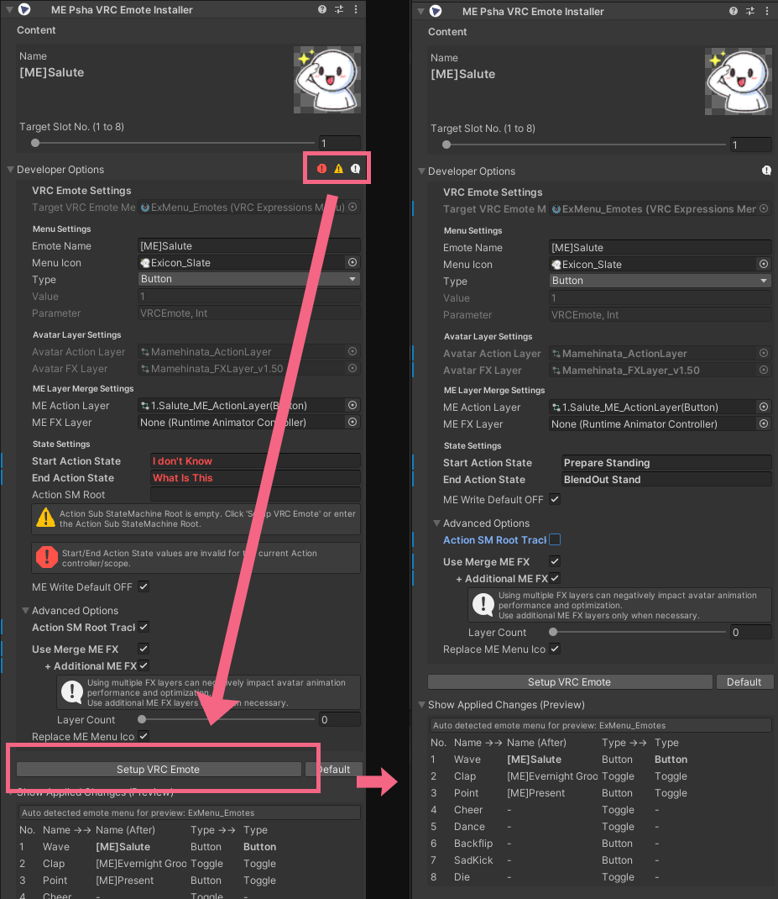

# VRC Emote Installer

`VRC Emote Installer`는 **애니메이션을 “프리팹 단위로 모듈화”하여 배포하고**,  
사용자는 **복잡한 Animator 수정 없이** 배포된 ME 프리팹을 아바타에 넣는 것만으로
Emote(1~8 슬롯)를 쉽게 도입할 수 있도록 도와주는 도구입니다.

---

## 요구사항 (지원 대상)

이 도구는 **VRCEmote(Emote Radial Menu)**를 사용하는 아바타를 전제로 동작합니다.

다음 조건을 만족하는 아바타에서 정상 동작을 기대할 수 있습니다.

- **레디얼 메뉴(Emote 메뉴)를 통해** `VRCEmote` 파라미터로 동작하는 아바타
- **VRChat 기본 Action 레이어**를 사용하거나,
  `VRCEmote` 파라미터를 기반으로 Emote 분기를 구성해 둔 Action 레이어가 있는 아바타

> 참고: “VRCEmote를 사용한다”는 것은 보통  
> 게임 내 레디얼 메뉴에서 Emote를 선택했을 때 `VRCEmote` 값(1~8)이 바뀌며 동작하는 구조를 의미합니다.

---

## 기본 도입 순서

1. 애니메이션을 적용할 **아바타를 씬에 배치**합니다.
2. 배포된 **ME 프리팹을 씬에 배치**합니다.
3. ME 프리팹을 **아바타의 하위(자식)로 드래그하여** 넣습니다. **(A)**
4. Installer에서 **Slot Index(1~8)** 값을 설정합니다. **(B)**

    { width="500" }

5. **VRChat SDK 메뉴에서 아바타를 Build**합니다.
6. 게임에서 **레디얼 메뉴(기본: R 버튼 길게 누르기)** → **Emote 메뉴**에서 적용 결과를 확인합니다. **(C)**

    { width="500" }

---

## 도입 설명 영상

- 사용자 도입 영상: *(링크 추가 예정)*

---

## 비대응 아바타 / 적용 문제 발생 시

배포된 ME 프리팹을 **지원 범위를 벗어난 아바타에 적용**하려 하거나,
적용 과정에서 문제가 발생하는 경우가 있습니다.

이때는 먼저 **개발자 옵션(Developer Options)**을 열어  
표시되는 문제 아이콘/상태를 확인한 뒤, 아래 흐름을 권장합니다.

### 권장 해결 방법: `Setup VRC Emote`

일반적으로 개발자 옵션에 있는 **`Setup VRC Emote` 버튼을 한 번 누르는 것만으로**  
스크립트가 가능한 범위에서 문제를 자동 처리하도록 설계되어 있습니다.

- 우선 `Setup VRC Emote`를 실행해 보세요.
- 자동 처리가 어려운 항목은 개발자 옵션에서 수동으로 조정할 수 있습니다.

  { width="500" }

---

## 주의사항 / 제한 사항

다음 케이스는 정상적인 결과를 보장하기 어렵습니다.

- **비대응 아바타**에 적용하는 경우
- 아바타의 **체형(리타게팅/스케일 차이)** 때문에 애니메이션이 맞지 않는 경우
- **FX 레이어 병합이 포함된 프리팹**을 비표준 구조의 아바타에 적용하는 경우
- `VRCEmote`를 사용하더라도 **Action 레이어 내부 구조가 매우 복잡한 서브 스테이트머신**인 경우  
  (추적 알고리즘이 start/end 흐름을 안정적으로 찾지 못해 병합이 실패할 수 있음)

또한 현재 버전은 기본적으로 다음 범위를 목표로 합니다.

- **Stand 기준 Emote 슬롯 1~8** 지원 (레디얼 메뉴의 8개 슬롯)

---