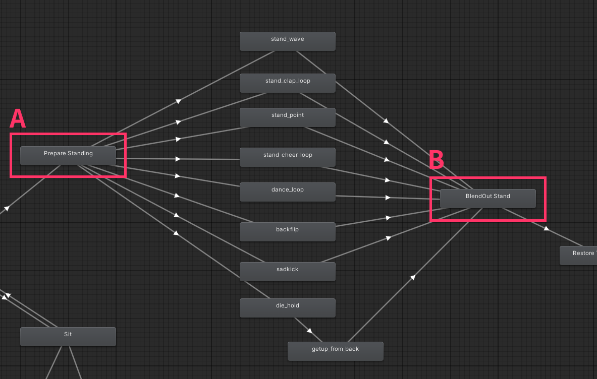

# VRC Emote Installer (Creator Guide)

`VRC Emote Installer` is a component you attach to a distributable Emote prefab  
so users can add the prefab to their avatar and get an Emote slot without manual Animator editing.

---

## 1) Basic Fields

### 1-1) Emote Name / Icon / Slot / Type

- **Emote Name**  
  The name shown in the menu.
- **Menu Icon**  
  The icon shown in the menu.
- **Slot Index**  
  The target Emote slot number (1–8).
- **Type**  
  The menu control type.

{ width="500" }

---

## 2) Developer Options

This section includes auto-detection, validation, and advanced configuration.  
If an issue is detected, its status is shown with **info/warning/error icons** on the right. **(A)**

  { width="500" }

### 2-1) Build Settings

- **Build-time Object Name**  
  Sets the object name that will be applied during avatar build.  
  If this field is left empty, the current GameObject name is used at build time.  
  When using **Use Merge ME FX**, it is recommended to set this value so later object renaming does not change animation paths and affect the build result.  
  If this field is empty, pressing **Setup VRC Emote** fills it with the current GameObject name.  
  This item is shown only when **Use Merge ME FX** is enabled in Advanced Options.

---

### 2-2) VRC Emote Settings

- **Target VRC Emote Menu**  
  Sets the Emote menu field to customize.  
  This uses **auto-detection**.

---

### 2-3) Menu Settings

These are the items that are actually applied to the menu.

- **Emote Name**  
  The name shown in the VRC Emote menu.

- **Menu Icon**  
  The icon shown in the VRC Emote menu.  
  If the icon is not a Texture2D asset, or its import settings are likely to fail VRC validation,  
  an **error box** may appear along with the **Fix Icon Settings (256, Compressed)** button.

- **Type**  
  The control type. `None` keeps the existing type.

- **Value** (Read-only)  
  The value corresponding to the selected slot number.

- **Parameter** (Read-only)  
  Displayed as `VRCEmote, Int`.

---

### 2-4) Avatar Layer Settings

Specifies the target avatar layer controllers.

- **Avatar Action Layer**  
  Uses the avatar descriptor Action layer setting via **auto-detection**.

- **Avatar FX Layer**  
  Uses the avatar descriptor FX layer setting via **auto-detection**.

---

### 2-5) ME Layer Merge Settings

- **ME Action Layer**  
  Assign the Action template (AnimatorController) to merge.  
  The template contents (states/transitions/parameters, etc.) are converted into a Sub StateMachine and inserted/replaced  
  in the avatar Action layer between the configured range (Start → End).  
  Any conditions in the template that use the `VRCEmote` parameter are converted to the **selected slot value**.  
  By default, only **layer 0** of the template is used.

- **ME FX Layer**  
  This field is enabled only when **Use Merge ME FX** is enabled in Advanced Options.  
  Assign the FX template (AnimatorController) to merge.  
  The prepared ME FX template (states/transitions/parameters, etc.) is merged/added to the avatar FX controller as a **new layer**.  
  Any conditions in the template that use the `VRCEmote` parameter are converted to the **selected slot value**.  
  By default, only **layer 0** of the template is used.

  > If multiple objects share the same ME FX layer, a warning may be shown because results can vary depending on configuration or naming.

---

### 2-6) State Settings

- **Start Action State**  
  The state name that marks where the emote branch begins in the avatar Action layer. **(A)**  
  You can auto-detect it with **Setup VRC Emote** or enter it manually.  
  If this is empty and the Action layer is Default (or Null), `Prepare Standing` is assumed by default.  
  If invalid, an error is shown.

- **End Action State**  
  The state name that marks where the emote branch ends in the avatar Action layer. **(B)**  
  You can auto-detect it with **Setup VRC Emote** or enter it manually.  
  If this is empty and the Action layer is Default (or Null), `BlendOut Stand` is assumed by default.  
  If invalid, an error is shown.

    { width="500" }

- **Action SM Root**  
  Shown only when **Action SM Root Tracking** is enabled in Advanced Options. **(C)**  
  If auto-tracking determines that a scope is required, running **Setup VRC Emote** may enable this field automatically.

---

### 2-7) Advanced Options

- **Action SM Root Tracking**  
  Limits tracking to a specific Sub StateMachine scope in the Action layer.

- **Use Merge ME FX**  
  Merges the FX template into the avatar FX controller.

- **Use Additional ME FX**  
  Expansion option for additional FX layers.

---

## 3) Setup VRC Emote

Pressing **Setup VRC Emote** automatically tries the following:

1. Find the avatar’s default Action / FX layers
2. Find the Emote menu in the ExpressionsMenu tree
3. Find the start / end Action states
4. Auto-track the Action SM Root when needed
5. Fill **Build-time Object Name** with the current GameObject name if it is empty

---

## 4) Build-time Behavior

- Expressions Menu is cloned and patched without modifying the original asset directly.
- Action / FX Animators are merged on the Virtual graph without modifying the original AnimatorController asset directly.
- If multiple installers target the same slot, the higher installer in the hierarchy wins.
- Even if multiple installers are attached to the same GameObject, only the topmost installer on that object applies **Build-time Object Name**.

---

## 5) Preview of Applied Changes

The Preview lets you check what will actually be applied before building.

### Radial Preview

<small>※ Available from version 1.5.1.</small>

- You can check where the current slot will be placed.
- The slot affected by the current component is highlighted as selected.
- Entries with icons and entries with text only are shown in a way that is closer to the in-game menu.

  { width="280" }

### List Preview

- As before, you can compare slot number / name (before & after) / type (before & after) in a table-like view.
- The slot that the current component actually changes is highlighted on the “After” side.

---
