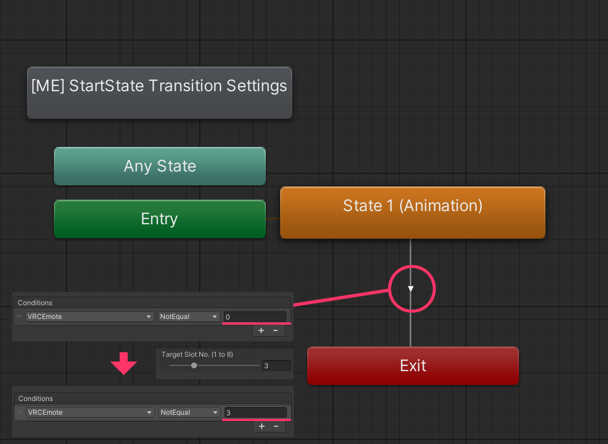

# ME Action Layer

`ME Action Layer` is an **Animator template (AnimatorController)** prepared for Modular Emote’s **Action merge algorithm**.  
At build time, the template contents (states/transitions/parameters, etc.) are converted into a **Sub StateMachine** and merged into the avatar’s **Action layer**.

---

## Sample Location

A sample template is provided in the package:

- `Packages/com.psha.modular.emote/Samples/ME Layer Templates`

---

## Where It Gets Merged (Concept)

The template is inserted between the configured **Start/End states** inside the avatar Action layer.

In other words, the flow becomes:

`Prepare Standing` → *(ME Template Sub StateMachine)* → `BlendOut Stand`   

   { width="600" }

> The Start/End states may differ depending on the Installer’s **Start Action State / End Action State** settings (or what Setup auto-detects).

## Template Parameter / Condition Rewrite Rules

Any **`VRCEmote` parameter** used as a condition in transitions inside the ME Action template is automatically rewritten at build time to match the **slot value (1–8)** selected in the Installer. 

   { width="500" }

- Example: even if the template contains a condition `VRCEmote == 1`,
  installing it into slot 3 will produce a build result where the condition becomes `VRCEmote == 3`.
- This rewrite applies to **all transition conditions** inside the template.

> This means you don’t need to author templates for a fixed slot number,  
> and you can reuse the same template across multiple slots.

---

## Configuring the “Start State → Template Sub StateMachine” Transition

If you want to control the transition properties (Exit Time, Duration, Interruption, etc.) for
the “transition from the Start state into the ME template Sub StateMachine”, use the  
**`Modular Emote Transition Settings`** Behaviour.

### How to Set Up

1. Add a standalone state to the ME Action template.
2. Name the state as follows:

   - `[ME] StartState Transition Settings`

3. Add the Behaviour to that state:

   - `Add Behaviour` → `Modular Emote Transition Settings`

4. Configure the transition values:
   - Exit Time / Duration / Offset / Interruption
   - Additional Conditions

   { width="800" } 

> If this Behaviour exists, the build process reconstructs the “Start state → Template entry” transition based on the configured values.

---

## Troubleshooting

### Q. Even after configuring Transition Settings, it does not switch quickly into the template.

This can happen if, along the path from **Entry → ME Sub StateMachine** in the avatar Action layer,
there is a state (often the Start state) that has a `VRC Playable Layer Control` Behaviour with an increased **Blend Duration**.

**Recommended fix**  
Add `VRC Playable Layer Control` to the **first state right after entering** the ME Action template,  
and adjust the blend settings so the transition speed matches your intent.

   { width="600" }    

---

### Q. Loop animations look wrong in Gesture Manager.

In some environments, Gesture Manager previews may not display loop animations correctly.  
If the preview looks different from what you expect, we recommend testing **in-game after building**.

---
